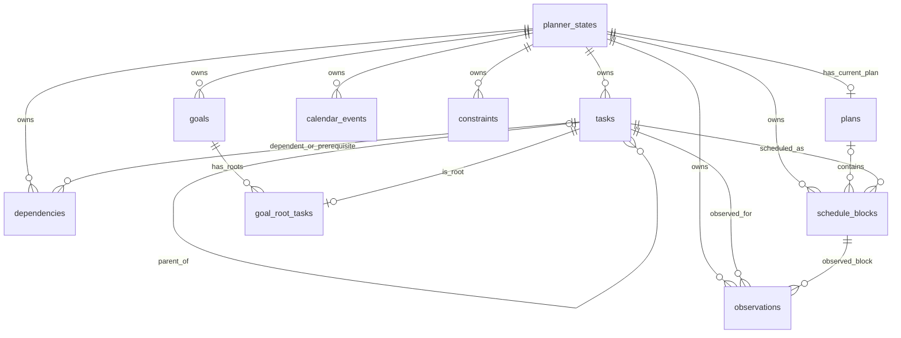

# DayPilot PostgreSQL Schema Design

This document specifies the relational representation for a complete
`PlannerState` aggregate. It is a design contract for the later SQLAlchemy
mapping work; it does not define ORM classes, migrations, or domain behavior.

PostgreSQL is the target database. `JSONB` is used for metadata and `BIGINT`
for integer microsecond timestamps and durations so the database representation
preserves the precision already used by the persistence records.

## Entity relationship diagram

Every relationship between child rows is scoped by `state_id`; the composite
foreign keys described below prevent a row in one planner state from
referencing an entity owned by another state.

## Table conventions

- `planner_states.id` is the externally supplied state ID.
- Child entity IDs are unique within their planner state. Their primary keys
  therefore include `state_id`, even when the ID itself is globally unique in
  practice.
- All child tables have a non-null `state_id` foreign key to
  `planner_states.id` with `ON DELETE CASCADE`. Deleting an aggregate removes
  all of its rows.
- References between child tables use composite keys that include `state_id`.
- `TIMESTAMPTZ` is reserved for database audit timestamps. Domain/persistence
  timestamps use signed integer microseconds since the Unix epoch, matching the
  existing persistence records.
- `JSONB` metadata columns are non-null and default to `{}`.

## Tables

### `planner_states`

Aggregate root. Its relationships are derived from child-table `state_id`
values; it does not store arrays of child IDs.

| Column | PostgreSQL type | Nullable | Key / constraint | Purpose |
|---|---|---:|---|---|
| `id` | `TEXT` | No | Primary key | Stable planner state ID supplied by the application. |
| `version` | `BIGINT` | No | `CHECK (version > 0)` | Aggregate version for optimistic concurrency. |
| `created_at` | `TIMESTAMPTZ` | No | Default `now()` | Row creation audit time. |
| `updated_at` | `TIMESTAMPTZ` | No | Default `now()` | Initialized on creation; application/persistence code updates it on every aggregate write. |

`updated_at` is maintained by the application/persistence layer. The default
only initializes inserts; no database trigger is part of this design.

### `tasks`

Tasks are owned by one state. `parent_task_id` stores the hierarchy edge;
`children_ids` is derived by querying rows that reference the task as parent.

| Column | PostgreSQL type | Nullable | Key / constraint | Purpose |
|---|---|---:|---|---|
| `state_id` | `TEXT` | No | PK part; FK to `planner_states.id` | Aggregate ownership. |
| `id` | `TEXT` | No | PK part; unique with `state_id` | Task's logical ID within its state. |
| `title` | `TEXT` | No | — | Task title. |
| `description` | `TEXT` | No | — | Task description. |
| `status` | `TEXT` | No | — | Serialized task status. |
| `scheduling_status` | `TEXT` | No | — | Serialized scheduling status. |
| `priority` | `TEXT` | Yes | — | Serialized priority, if set. |
| `estimated_duration_microseconds` | `BIGINT` | No | `CHECK (estimated_duration_microseconds >= 0)` | Estimated duration with explicit unit. |
| `deadline_timestamp_microseconds` | `BIGINT` | Yes | — | Optional deadline timestamp. |
| `metadata` | `JSONB` | No | Default `{}` | Task metadata. |
| `parent_task_id` | `TEXT` | Yes | Composite self-FK `(state_id, parent_task_id)` → `tasks(state_id, id)` | Optional parent in the same state. |

The primary key is `(state_id, id)`. The self-FK prevents cross-state parent
references. A task's child list is never stored as a separate column. The
database can reject direct self-parenting with a check constraint; longer
hierarchy cycles remain a domain invariant.

### `goals`

| Column | PostgreSQL type | Nullable | Key / constraint | Purpose |
|---|---|---:|---|---|
| `state_id` | `TEXT` | No | PK part; FK to planner state | Aggregate ownership. |
| `id` | `TEXT` | No | PK part | Goal's logical ID within its state. |
| `title` | `TEXT` | No | — | Goal title. |
| `description` | `TEXT` | No | — | Goal description. |
| `deadline_timestamp_microseconds` | `BIGINT` | Yes | — | Optional deadline timestamp. |
| `status` | `TEXT` | No | — | Serialized goal status. |

Primary key: `(state_id, id)`.

### `goal_root_tasks`

Join table for the many-to-many-shaped root-task association. The domain
currently prevents a task from being a root of multiple goals, so the schema
also enforces that rule within a state.

| Column | PostgreSQL type | Nullable | Key / constraint | Purpose |
|---|---|---:|---|---|
| `state_id` | `TEXT` | No | PK part; FK to planner state | Aggregate ownership. |
| `goal_id` | `TEXT` | No | PK part; composite FK `(state_id, goal_id)` → `goals(state_id, id)` | Owning goal. |
| `task_id` | `TEXT` | No | PK part; composite FK `(state_id, task_id)` → `tasks(state_id, id)` | Root task. |

Primary key: `(state_id, goal_id, task_id)`. Additional unique constraint:
`UNIQUE (state_id, task_id)`.

### `dependencies`

Each row represents one directed edge from a dependent task to a prerequisite.
The graph's cycle, duplicate, same-tree, and scheduling rules remain domain
responsibilities.

| Column | PostgreSQL type | Nullable | Key / constraint | Purpose |
|---|---|---:|---|---|
| `state_id` | `TEXT` | No | PK part; FK to planner state | Aggregate ownership. |
| `dependent_task_id` | `TEXT` | No | PK part; composite FK to `tasks(state_id, id)` | Task that depends on another. |
| `prerequisite_task_id` | `TEXT` | No | PK part; composite FK to `tasks(state_id, id)` | Required task. |

Primary key: `(state_id, dependent_task_id, prerequisite_task_id)`. Check:
`dependent_task_id <> prerequisite_task_id`. Composite FKs guarantee both tasks
belong to the dependency's state.

### `calendar_events`

| Column | PostgreSQL type | Nullable | Key / constraint | Purpose |
|---|---|---:|---|---|
| `state_id` | `TEXT` | No | PK part; FK to planner state | Aggregate ownership. |
| `id` | `TEXT` | No | PK part | Calendar event ID within the state. |
| `title` | `TEXT` | No | — | Event title. |
| `start_timestamp_microseconds` | `BIGINT` | No | — | Start timestamp. |
| `end_timestamp_microseconds` | `BIGINT` | No | `CHECK (start_timestamp_microseconds < end_timestamp_microseconds)` | End timestamp. |
| `metadata` | `JSONB` | No | Default `{}` | Event metadata. |

Primary key: `(state_id, id)`.

### `constraints`

The relational row requires stable identity even though the current domain
`Constraint` has no ID. The schema assigns a generated `UUID` as
`constraint_id`; this is the persistence identity and remains stable if the
constraint's type, time range, or description changes.

| Column | PostgreSQL type | Nullable | Key / constraint | Purpose |
|---|---|---:|---|---|
| `state_id` | `TEXT` | No | PK part; FK to planner state | Aggregate ownership. |
| `constraint_id` | `UUID` | No | PK part; `DEFAULT gen_random_uuid()` | Stable persistence identity. |
| `type` | `TEXT` | No | — | Serialized constraint type. |
| `start_timestamp_microseconds` | `BIGINT` | No | — | Constraint window start. |
| `end_timestamp_microseconds` | `BIGINT` | No | `CHECK (start_timestamp_microseconds < end_timestamp_microseconds)` | Constraint window end. |
| `description` | `TEXT` | No | — | Constraint description. |

Primary key: `(state_id, constraint_id)`. `ConstraintRecord` carries this UUID
as persistence identity; the domain `Constraint` remains unchanged and has no
ID. The persistence mapper can preserve an existing UUID when the persistence
layer supplies it.

### `plans`

The domain has at most one current plan per planner state. Absence of a row
represents `current_plan is None`; no `planner_states.current_plan_id` column or
list of block IDs is needed.

| Column | PostgreSQL type | Nullable | Key / constraint | Purpose |
|---|---|---:|---|---|
| `state_id` | `TEXT` | No | PK part; FK to planner state | Aggregate ownership. |
| `id` | `TEXT` | No | PK part | Plan ID within the state. |
| `date_timestamp_microseconds` | `BIGINT` | No | — | Plan start/date timestamp. |
| `planning_horizon_microseconds` | `BIGINT` | No | `CHECK (planning_horizon_microseconds > 0)` | Planning horizon duration. |
| `metadata` | `JSONB` | No | Default `{}` | Plan metadata. |

Primary key: `(state_id, id)`. Additional unique constraint:
`UNIQUE (state_id)` enforces one current plan per state.

### `schedule_blocks`

Schedule block identity follows the existing stable
`schedule_block_id(task_id, start_microseconds, end_microseconds)` strategy.
Blocks in the current plan reference its `plan_id`. A block retained only
because an observation references it has a null `plan_id`; this allows the
single current plan to be replaced without losing historical observation data.

| Column | PostgreSQL type | Nullable | Key / constraint | Purpose |
|---|---|---:|---|---|
| `state_id` | `TEXT` | No | PK part; FK to planner state | Aggregate ownership. |
| `id` | `TEXT` | No | PK part | Stable schedule block persistence ID. |
| `task_id` | `TEXT` | No | Composite FK `(state_id, task_id)` → `tasks(state_id, id)` | Scheduled task. |
| `plan_id` | `TEXT` | Yes | Composite FK `(state_id, plan_id)` → `plans(state_id, id)` | Current plan, if this block belongs to it. |
| `start_timestamp_microseconds` | `BIGINT` | No | — | Block start. |
| `end_timestamp_microseconds` | `BIGINT` | No | `CHECK (start_timestamp_microseconds < end_timestamp_microseconds)` | Block end. |
Primary key: `(state_id, id)`. Add `UNIQUE (state_id, task_id, id)` to support
the observation composite FK. The repository must detach observation-retained
blocks from a replaced plan before deleting that plan.

### `observations`

| Column | PostgreSQL type | Nullable | Key / constraint | Purpose |
|---|---|---:|---|---|
| `state_id` | `TEXT` | No | PK part; FK to planner state | Aggregate ownership. |
| `id` | `TEXT` | No | PK part | Stable observation persistence ID. |
| `task_id` | `TEXT` | No | Composite FK with `schedule_block_id` below | Task observed. |
| `schedule_block_id` | `TEXT` | No | Composite FK `(state_id, task_id, schedule_block_id)` → `schedule_blocks(state_id, task_id, id)` | Exact scheduled block observed. |
| `actual_start_timestamp_microseconds` | `BIGINT` | No | — | Actual work start. |
| `actual_end_timestamp_microseconds` | `BIGINT` | No | `CHECK (actual_start_timestamp_microseconds < actual_end_timestamp_microseconds)` | Actual work end. |
| `outcome` | `TEXT` | No | — | Serialized observation outcome. |
| `metadata` | `JSONB` | No | Default `{}` | Observation metadata. |

Primary key: `(state_id, id)`. The schedule block target exposes
`UNIQUE (state_id, task_id, id)` for the composite FK. This FK ensures the
observation's task and block belong together as well as to the same aggregate.

## Integrity rules and ownership boundaries

PostgreSQL should enforce structural facts:

- Primary keys, non-null columns, and aggregate-owned foreign keys.
- Uniqueness of child IDs within a state, goal-root associations, dependency
  edges, and the single plan per state.
- Same-state references for task hierarchy, goal roots, dependencies,
  schedule blocks, and observations.
- Basic numeric and interval validity: positive aggregate version and plan
  horizon, non-negative task duration, and start before end.
- No direct self-parent or self-dependency.

The domain remains responsible for longer task hierarchy cycles, dependency
cycles, dependency/tree compatibility, scheduling eligibility, aggregate
ownership behavior, replanning, and business-level observation rules.

## Design decisions to carry into ORM work

1. Every child is identified by `(state_id, id)` or a natural composite key;
   all references include `state_id` to prevent cross-aggregate links.
2. `goal_root_tasks` is the join table. Task hierarchy uses a self-referencing
   FK. Task children are never duplicated in a `children_ids` database column.
3. `ConstraintRecord.constraint_id` is a UUID and is independent of mutable
   constraint values; the domain model remains ID-free.
4. Schedule blocks use the existing stable synthetic ID and may be detached
   from the current plan while retained for observations.
5. A unique `plans.state_id` enforces the current one-plan-per-state domain
   shape. `planner_states` has no denormalized current plan or child ID lists.
6. Composite foreign keys enforce that references stay within one
   `PlannerState`; domain-only graph and scheduling rules are not encoded as
   database triggers.

No SQLAlchemy ORM models, migrations, or live database objects are part of
this schema-design milestone.
